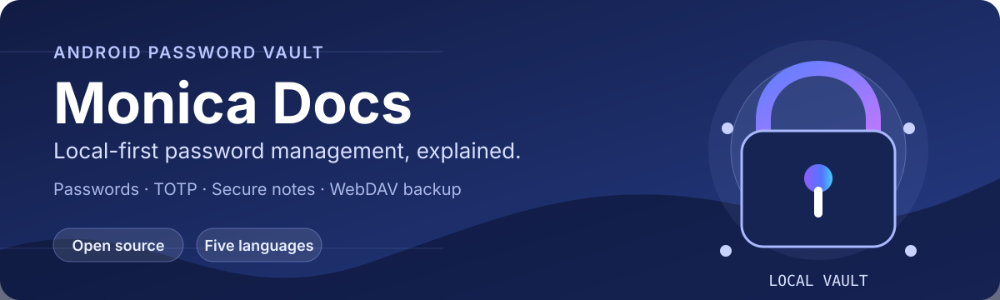

<p align="center">
  <b>English</b>
  &nbsp;·&nbsp;
  <b><a href="README.md">简体中文</a></b>
</p>

<p align="center">
  
</p>

<p align="center">
  <a href="https://monica-pass.github.io/MonicaDocs/">Browse Docs</a>
  &nbsp;·&nbsp;
  <a href="https://github.com/Monica-Pass/Monica">Monica Android</a>
  &nbsp;·&nbsp;
  <a href="https://github.com/Monica-Pass/Monica/releases">Download Releases</a>
</p>

# MonicaDocs

MonicaDocs is the source code of the standalone documentation site for [Monica](https://github.com/Monica-Pass/Monica).  
Monica is an open-source, local-first Android password manager for passwords, TOTP codes, bank cards, and encrypted notes;  
the docs site provides Simplified Chinese, English, 日本語, Русский, and Tiếng Việt content.

## Run the docs site locally

Requirements: Node.js 22+ and npm.

```bash
npm ci
npm run docs:dev
```

The dev server defaults to `http://localhost:5173/MonicaDocs/`. When publishing to a different GitHub Pages path, adjust the `base` in `.vitepress/config.mts` accordingly.

| Command | Purpose |
| --- | --- |
| `npm run docs:dev` | Start the local dev server with hot reload. |
| `npm run docs:build` | Generate a production build. |
| `npm run docs:preview` | Preview the production build locally. |

## Maintenance Notes

- Simplified Chinese content lives in `01.指南`, `02.配置`, and `03.生态`; other languages live in `en`, `ja`, `ru`, and `vi`.
- Multilingual navigation, edit links, and rewrite rules live in `.vitepress/locales/`; theme components and styles live in `.vitepress/theme/`.
- GitHub Pages builds `.vitepress/dist/` and deploys via Actions after pushing to `main`.
- `update-github-commits.yml` periodically updates `public/github-commits.json` and requires a `MONICA_SOURCE_REPO_TOKEN` with `Contents: Read` permission.
- Publishing an Android or browser extension release from the main repository immediately triggers `update-github-releases.yml` to fetch the latest release metadata and assets before redeploying the site.
- Updates to the Monica main repository's `main` branch trigger an immediate commit-data sync through `repository_dispatch`; configure `DOCS_REPOSITORY` and a `DOCS_REPO_TOKEN` with write access to this repository in the source repository.

## Acknowledgements

- [Monica](https://github.com/Monica-Pass/Monica)
- [VitePress](https://github.com/vuejs/vitepress)
- [Teek](https://github.com/Kele-Bingtang/vitepress-theme-teek)

## License

This repository is released under the [GNU General Public License v3.0](./LICENSE), consistent with the Monica main project. Unless a file states otherwise, copy, modify, and distribute in accordance with the GPL-3.0 terms.
